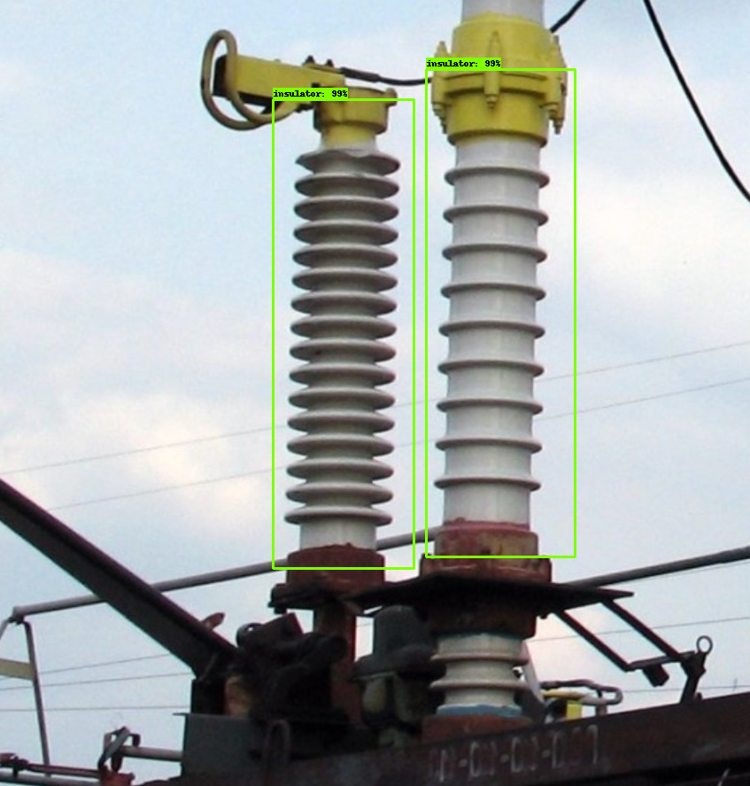

# JetsonNanoInsulatorDetection
Detection insulator with ssd_mobilenet_v1 custom trained network.
***
After all steps of first steps with NVidia Jetson Nano development board (link - https://developer.nvidia.com/embedded/learn/get-started-jetson-nano-devkit) we need to make all requirement installation for tensorflow inference tests with custom ssd_mobilenet_v1 network (trained to detect insulators of power supply substation).
***
1. Installing base dependancies and pip
```
sudo apt-get update
sudo apt-get install git cmake
sudo su
apt-get install libatlas-base-dev gfortran
apt-get install libhdf5-serial-dev hdf5-tools
sudo apt-get install python3-dev

wget https://bootstrap.pypa.io/get-pip.py
sudo python3 get-pip.py
sudo apt install python3-testresources
sudo rm get-pip.py
```
2.tensorflow and others
```
sudo pip install numpy
sudo pip install --extra-index-url https://developer.download.nvidia.com/compute/redist/jp/v42 tensorflow-gpu==1.13.1+nv19.3

sudo pip install scipy
sudo pip install keras
```
this libraries need good internet connection and time for installlation ( from 15 to 40 minutes) <br/><br/>

Now any of pre-trained Keras and tensorflow models can run on Jetson Nano board.
***
2. installing pretrained models for TensorRT from https://github.com/NVIDIA-AI-IOT/tf_trt_models
```
cd ~
git clone --recursive https://github.com/NVIDIA-Jetson/tf_trt_models.git
cd tf_trt_models
./install.sh python3
```
You have all installed TensorRT models in /tf_trt_models and also in /tf_trt_models/third_party/models all Tensorflow models zoo (https://github.com/tensorflow/models)

example

